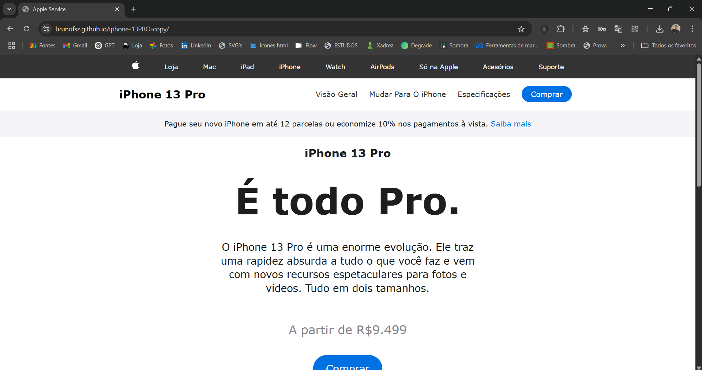

# iPhone 13 Pro - Apple Store Clone 🍏

Este é um projeto de **cópia da página do iPhone 13 Pro da Apple**, criado com **HTML, CSS e JavaScript puro**. O objetivo é treinar habilidades de front-end como layout responsivo, troca dinâmica de imagens e menus interativos.

## 🧩 Funcionalidades

- Barra de navegação com links simulados  
- Seção promocional com botão de compra  
- Informações sobre o produto: nome, descrição e preço  
- Imagem do iPhone que muda conforme a cor selecionada  
- Cores disponíveis:
  - Verde Musgo
  - Prateado
  - Dourado
  - Grafite
  - Azul Tietê
- Estilização moderna e responsiva para dispositivos móveis

## 🧠 Tecnologias utilizadas

- HTML5  
- CSS3  
- JavaScript (Vanilla JS)

## 💻 Como usar

- Acesse: [https://brunofsz.github.io/iphone-13PRO-copy/](https://brunofsz.github.io/iphone-13PRO-copy/)

   **OU**

1. Clone o repositório: https://github.com/brunofsz/iphone-13PRO
2. Navegue até a pasta do projeto
3. Abra o arquivo `index.html` com o navegador de sua preferência

## 📸 Preview

